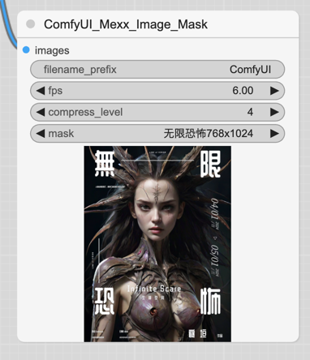

# ComfyUI_Mexx_Poster

## 功能简述

使用图片模版，对图片进行编辑，形成定制化的图片，比如游戏卡牌、海报、商业广告等。

## 使用图例

- ComfyUI Workflow DEMO文件：[workflow-lcm-无限恐怖768.json](workflow-lcm-%E6%97%A0%E9%99%90%E6%81%90%E6%80%96768.json)
- ComfyUI Workflow DEMO文件中使用的风格插件是：https://github.com/SoftMeng/ComfyUI_Mexx_Styler
- ComfyUI Workflow DEMO文件中使用LCM大模型是：https://civitai.com/models/217692/mexxldimsdxllcm2

如不使用LCM大模型，那么需要调整采样器和采样器的执行步数。

## 生成的效果图

